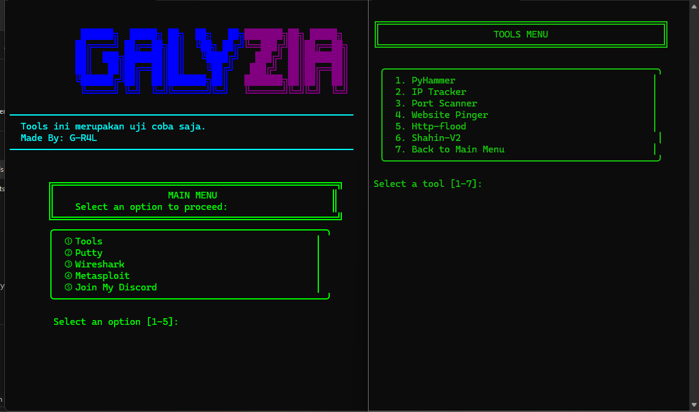

# GalyziaV2  

A testing tools collection made by me.  
Designed to work on **Windows**.  
(This is a continuation of the first version, now using **Python**, so make sure Python is installed.)

🔧 **Catatan** 🇮🇩:  
Tools ini masih dalam tahap **uji coba dan pengembangan pribadi**.  
Fitur-fitur akan terus diperbarui dan disempurnakan.

## How to Use

1. Download the ZIP file and extract it.  
2. Run the `Galyzia.bat` file, or open it via Command Prompt.  
3. Option **5** in the tools menu lets you join my Discord server. 😄

Thanks for using it! 🙏
